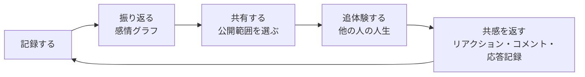
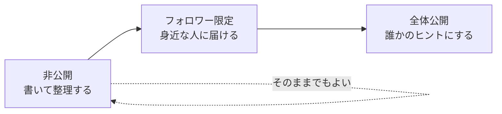

# LifeTrace 活用マニュアル

2026年9月24日 · @牛頭峰一

LifeTraceは、自分の人生経験を記録し、他の人の人生経験と分かち合うアプリです。このマニュアルは、基本操作の先にある「経験を語る・読む・返す」を習慣にするための使い方をまとめています（対象バージョン 1.2.0）。

## 1. LifeTraceの考え方

LifeTraceでは、一人が「語る人」「読む人」「返す人」の3つの役割を行き来します。発信するだけ、読むだけでは経験は循環しません。3つを回すことで、自分の記録が誰かのヒントになり、誰かの記録が自分の次の記録を生みます。

| 役割 | やること | 使う画面 |
|---|---|---|
| 語る人 | 自分の出来事と、そのときの気持ちを記録する | 「記録する」ボタン、マイページ |
| 読む人 | 他の人の人生を、起きた順にたどる | ホーム、さがす、追体験モード |
| 返す人 | 読んで感じたことを、リアクションやコメント、応答記録で伝える | 詳細画面、追体験モード |



読んだ経験に心が動いたら、自分の似た経験を記録する。この「応答としての記録」が、LifeTraceを日記アプリではなく、経験を分かち合う場所にします（第8章）。

大切にしたい3つの前提があります。

- **比べない**：人生に正解や勝ち負けはありません。違いは「背景と感じ方の違い」として受け取ります。
- **決めつけない**：同じ出来事でも、感じ方や選択は人によって異なります。
- **守る**：自分と、記録に登場する他人のプライバシーを守ります。

## 2. はじめる前の準備

最初に「設定 → プロフィールを編集」で次の4項目を整えます。この準備で、読む人があなたの経験の背景を理解しやすくなります。

| 項目 | おすすめの設定 | 理由 |
|---|---|---|
| 表示名 | 実名ではなくニックネーム | 全体公開の記録から本人が特定されるのを防ぐ |
| 自己紹介 | 下の型で2〜3行 | 読む人が「どんな背景の人の経験か」をつかめる |
| 生年月 | 入力しておく（例: 1990-04） | 記録に「28歳ごろ」と表示され、年代での検索にも使われる |
| デフォルトの公開範囲 | 「非公開」（新規アカウントの既定値） | 書いてから公開を判断できる（第5章） |

自己紹介の型は次のとおりです。

```
[今の立場]。[これまでの歩みを一言で]。
[共有したい経験のテーマ]について記録しています。
```

例：「IT企業で働く会社員。製造業の品質管理から転職しました。遠回りのキャリアと学び直しについて記録しています。」

最後に、ホーム右上の「？」から「LifeTraceの使い方」を一度読んでおくと、各画面への移動が速くなります。

## 3. 伝わる記録の書き方

他の人のヒントになる記録には、出来事だけでなく「そのとき何を考え、どう選んだか」が書かれています。「記録する」の5ステップを、次のように使います。

### ① いつの出来事？

年月はおおよそで構いません。記録は起きた年月の順に並び、追体験モードもこの順番で表示されます。長く続いた期間の出来事は、始まった月か、気持ちが大きく動いた月を選びます。

### ② 何があった？（タイトルと本文）

タイトルは「出来事＋変化」で書くと、ホームで目に留まりやすくなります。

| 弱いタイトル | 伝わるタイトル |
|---|---|
| 転職 | 10年勤めた会社を辞めて、未経験の業界へ |
| 大学入学 | 社会人を経て、遠回りで大学へ |
| 失恋 | 別れをきっかけに、一人の時間の使い方を変えた |

本文は、次の5つの問いに順に答えると書きやすくなります。本文欄の下の「書き方のヒント（5つの問い）を入れる」を押すと、この問いが本文に入ります。全部埋める必要はありません。

```
【状況】そのとき、どんな状況だった？
【迷い】何に悩み、どんな選択肢があった？
【選択】どうした？決め手は何だった？
【その後】結果、何が変わった？
【今思うこと】同じ場面にいる人に伝えたいことは？
```

最後の「今思うこと」はアドバイスではなく、「私の場合はこうだった」という形で書くと、読む人が自分の状況に当てはめやすくなります。

### ③ どんな気持ちだった？

選んだ気持ちが、感情グラフの高さ（スコア）になります。今の気持ちではなく、その出来事のときの気持ちを選びます。

| 気持ち | スコア | 選ぶ目安 |
|---|---|---|
| 最高に嬉しい | +5 | 人生で数回の喜び |
| 嬉しい | +3 | はっきり良かったと言える出来事 |
| 誇り | +3 | 自分の力でやり遂げたと感じた |
| 安心 | +2 | 不安が解けた、落ち着いた |
| 普通 | 0 | 記録として残したい節目 |
| 不安 | −2 | 先が見えなかった |
| 辛い | −3 | 苦しい時期が続いた |
| 悲しい | −4 | 大切なものを失った |
| 絶望 | −5 | 人生で数回のどん底 |

「最高に嬉しい」と「絶望」を出し惜しみしないと、グラフの山と谷がはっきりして、読む人にも転機が伝わりやすくなります。

### ④ どんなジャンル？

ジャンルは「さがす」で他の人があなたの経験を見つける入口になります。1つしか選べないので、「同じ悩みを持つ人が探すジャンル」を選びます。

- **学業・仕事・家族・恋愛・健康・転居**：出来事の分野がはっきりしているとき
- **挑戦・挫折・達成**：分野よりも経験の性質を伝えたいとき（例：資格試験の不合格は「学業」でも「挫折」でもよいが、立ち直りを伝えたいなら「挫折」）
- **その他**：どれにも当てはまらないときだけ

### ⑤ 誰に見せる？

迷ったら「非公開」で保存します。公開範囲はあとから変えられます（第5章）。「全体公開」を選ぶと、公開前に確かめたい3つのことが表示されます。

### 転機マークと写真

「人生の転機としてマークする」は、その前と後で生き方が変わった出来事だけに使います。目安は全体の1割ほどです。転機が多くなりすぎると、フォームに案内が表示されます。転機が少ないほど、追体験する人に「この人の人生の分かれ道」が伝わります。写真は、人の顔や住所、制服、名札が写っていないもの（風景、手元、道具など）を選びます。

## 4. 自分の人生年表をつくる

最初の30分で、人生の節目を10件ほど記録します。これだけで感情グラフに山と谷が現れ、追体験する人にも「一人の人生」として読める形になります。

### 最初の30分の進め方

1. **節目を洗い出す（5分）**：下の表を見ながら、タイトルだけメモに書き出す
2. **要点だけ記録する（20分）**：本文は1〜2文でよい。公開範囲はすべて「非公開」
3. **グラフを見る（5分）**：マイページの「感情グラフ」で全体の形を確かめる

| 時期 | 思い出しやすい節目 |
|---|---|
| 子ども時代 | 引っ越し、夢中になったもの、影響を受けた人 |
| 学生時代 | 入学、部活や留学、進路の決断、卒業 |
| 働き始めてから | 就職、異動や転職、大きな失敗と成功、資格 |
| 暮らし | 一人暮らし、結婚や別れ、家族の変化、引っ越し |
| 最近 | 今取り組んでいること、最近の小さな変化 |

詳しい本文は、あとで公開したい記録から順に書き足します（第3章の5つの問い）。

### 感情グラフの読み方

グラフは成績表ではなく、「自分がどう回復してきたか」の地図です。次の3点を見ます。

- **谷の後**：谷の次に何が起きたか。「谷からの回復」の欄に、谷と次の山の組が表示されます。そこにあなたの立ち直り方が表れています
- **転機の前後**：転機の前と後で、波の大きさやジャンルがどう変わったか
- **ジャンルの割合**：円グラフで、自分が人生のどの領域を多く記録しているか

谷から山への流れが見つかったら、その区間の記録が最初に公開する候補です。同じ谷にいる誰かにとって、もっとも役に立つ経験だからです（回復の記録が非公開のときは、グラフ上で案内が出ます）。

## 5. 公開範囲を段階的に使う

記録は「非公開 → フォロワー限定 → 全体公開」の順に、気持ちの整理がついたものから広げていきます。公開範囲は記録ごとに、あとから何度でも変えられます。マイページの一覧では、非公開の記録に🔒、フォロワー限定の記録に👥のアイコンが付きます。



| 段階 | 向いている記録 | 次の段階に進む目安 |
|---|---|---|
| 非公開 | まだ整理できていない経験、書きかけの下書き、自分だけの日記 | 読み返して、今の自分が落ち着いて読める |
| フォロワー限定 | 家族や友人、継続して交流している人に知ってほしい経験 | 知らない人にも役立つと思える |
| 全体公開 | 同じ場面にいる誰かの参考になってほしい経験 | — |

全体公開の前に、次の3つを確かめます。

- [ ] 書いたことを、知らない人に読まれても後悔しない
- [ ] 登場する人が読んでも困らない書き方になっている
- [ ] 名前・学校名・勤務先・住所など、本人を特定できる情報がない（第10章）

電話番号・メールアドレス・郵便番号・番地などが含まれていると、保存する前にアプリが確認を表示します。

**アカウントの削除について**：アカウントを削除すると、ライフイベント（届いたコメント・リアクションを含む）、フォロー、お知らせ、プロフィールがすべて削除されます。削除にはパスワードでの本人確認が必要で、取り消せません。

## 6. 他の人の人生にふれる

他の人の記録は、「目的を決めて探す」と「一人の人生を通して読む」の2つの読み方を使い分けます。

### 目的別の探し方

「さがす」の「今の状況から探す」で、次の入口を選べます。ジャンル・気持ち・出来事が起きた年代は組み合わせて絞り込めます（年代は、生年月を登録している人の記録が対象です）。

| 今の状況 | 探し方 | 読むときのポイント |
|---|---|---|
| 進路や転職に迷っている | ジャンル：仕事 | 選んだ理由と、その後の気持ちの変化 |
| 先が見えず不安 | 気持ち：不安 | 同じ不安をどう過ごしたか |
| 失敗から立ち直りたい | ジャンル：挫折 | その人のページで、挫折の次の記録 |
| 新しいことを始めたい | ジャンル：挑戦 | 始める前に何を準備したか |
| 引っ越しや環境の変化を控えている | ジャンル：転居 | 慣れるまでの期間と工夫 |
| 元気がほしい | 気持ち：最高に嬉しい | そこに至るまでの道のり |

### 追体験モードで一人の人生を読む

気になる記録を見つけたら、投稿者のページで「追体験する」を押します。出来事が起きた順に並び、スワイプでめくれます。1件だけでは分からない「前後のつながり」が読めるのが追体験の価値です。

1. 最初に、その人の「感情グラフ」で山と谷の位置をつかむ
2. 追体験では、谷の記録から次の山までを特に丁寧に読む（どう乗り越えたかが書かれている）
3. 心が動いた記録には、その場で「この出来事に気持ちを送る」から反応する
4. 読み終えたら、自分にも似た出来事がなかったか思い出す（第8章）

時間がないときは、右上の「転機だけ」を選ぶと、その人の人生の分かれ道だけをたどれます。

読み続けたい人はフォローします。フォローすると、その人の「フォロワー限定」の記録も読めるようになります。

## 7. 共感を返す

経験を公開した人にとって、反応は「誰かに届いた」という唯一の手応えです。リアクションは意味を使い分け、心が動いたときはコメントも添えます。

| リアクション | 使うとき | 相手に伝わること |
|---|---|---|
| ❤️ いいね | 読んでよかった、応援したい | 読んでくれた人がいる |
| 🤝 わかる | 自分にも似た経験や気持ちがある | 同じ道を通った人がいる |
| 🥹 感動した | 自分にはない経験に心を動かされた | 自分の経験が誰かを動かした |

### コメントの型

コメントは「受け止める → 自分のことを少し → 気持ちを返す」の3文で十分です。相手の経験の評価や助言ではなく、「読んで私はこう感じた」を伝えます。

```
【受け止める】どの部分が心に残ったか
【自分のこと】自分の似た経験、または今の状況（任意）
【返す】感謝や、読んで変わったこと
```

| 良い例 | 避けたい例 |
|---|---|
| 「不合格の後に勉強法を変えたところが心に残りました。私も今、同じ試験に落ちたばかりです。もう一度やってみようと思えました。」 | 「もっと早く切り替えればよかったのに。」（選択を評価している） |
| 「転職を決めた理由がとても具体的で、自分の状況を整理する助けになりました。」 | 「私のほうが大変でした。」（比べている） |
| 「この時期の気持ち、よく分かります。書いてくれてありがとうございます。」 | 「どこの会社ですか？」（個人情報を聞き出している） |

自分の記録にリアクションやコメントが届くと、下部メニューの「お知らせ」に件数が表示されます。コメントには一言でも返信しましょう。

## 8. 経験の往復と習慣化

他の人の経験を読んで、自分の似た経験を記録で返す。この「応答記録」が、LifeTraceでもっとも深い共有のしかたです。コメントが「言葉の返事」なら、応答記録は「人生の返事」です。

### 応答記録の書き方

1. 読んだ記録に「わかる」を送る
2. 記録の詳細画面の「この記録に応えて、自分の経験を記録する」（追体験モードでは「似た経験を記録する」）を押す
3. 自分の似た出来事を、その出来事が起きた年月で記録する
4. 公開すると、元の記録の下に「この記録に応えた経験」として表示され、書いた人にお知らせが届く

同じ出来事でも、選択や感じ方が違うことを書くのが大切です。「私は逆の道を選んだ」という記録は、読む人にとっても選択肢を広げます。

### 習慣にする

| 頻度 | やること | 時間 |
|---|---|---|
| 週に1回 | ホームで新しい記録を読み、3件に反応する。お知らせに返信する | 10分 |
| 月に1回 | その月の出来事を1件記録する。追体験モードで一人の人生を通して読む | 20分 |
| 年に1回（誕生日や年末） | 感情グラフで一年を振り返る。非公開の記録を読み返し、公開範囲と転機マークを見直す | 60分 |

誕生月と12月には、ホームに一年のふり返りの案内が表示されます。年に1度の見直しでは、過去の記録の本文に「今思うこと」を追記するのもおすすめです。時間がたって見えたことは、その時期の渦中にいる人にとってもっとも貴重な情報です。

## 9. シーン別の活用例

同じ機能でも、目的によって記録の仕方と公開の仕方が変わります。

| シーン | 記録の仕方 | 公開・交流の仕方 |
|---|---|---|
| 転職・キャリアチェンジ | 仕事の節目を時系列で記録し、やりがいを感じた時期と辛かった時期を比べる | 「仕事」で他の人の転職記録を読む。決断の理由を書いた記録を全体公開する |
| 学び直し・資格挑戦 | 始めたきっかけ、不合格や停滞、達成をそれぞれ1件ずつ記録する | 途中の記録も公開すると、同じ道の人と励まし合える |
| 挫折からの回復 | 谷の出来事と、その後の小さな回復を段階的に記録する | 落ち着いてから公開。谷だけでなく回復までをセットで届ける |
| 家族に歩みを残す | 子ども時代から順に、写真を添えて記録する | 家族にフォローしてもらい、「フォロワー限定」で共有する |
| 進路に迷う学生 | 自分の好きなことや影響を受けた出来事を記録する | 「学業」「仕事」と年代で、年上の人の人生を追体験し、選択肢を広げる |
| 引っ越し・新生活 | 移った月と慣れた月を2件で記録する | 「転居」で他の人の慣れるまでの工夫を読む |

どのシーンでも、「谷→回復」や「迷い→決断→その後」のように、2〜3件を流れとして公開すると、追体験する人に物語として伝わります。

## 10. 安全とマナー

人生経験には、自分以外の人が必ず登場します。公開する前に、自分と登場する人の両方を守れているか確かめます。

### 書かないこと

| 書かない | 代わりの書き方 |
|---|---|
| 実名（自分・他人とも） | 「当時の上司」「大学の友人」 |
| 学校名、会社名、店名 | 「地元の高校」「製造業の会社」 |
| 住所、最寄り駅、細かい地名 | 「関東の都市」「地方の町」 |
| 他人の病気や私生活の詳細 | 自分がどう感じ、どう行動したかだけを書く |
| 特定の人への批判や暴露 | 出来事を自分の観点から書く |

写真も同じです。他人の顔、車のナンバー、窓からの景色など、場所や人が分かるものは避けます。

### つらい経験を書くとき、読むとき

- まだ渦中にいる経験は、非公開で書くだけにして、公開は落ち着いてから決める
- 読んでいてつらくなったら、アプリから離れてよい
- 辛い状態が続くときは、記録だけで抱え込まず、身近な人や自治体の相談窓口などに話す

### 困ったとき

| 状況 | 対応 |
|---|---|
| 嫌なコメントや不快な投稿がある | ユーザーページ右上の「︙」から通報する |
| 特定の人と関わりたくない | ユーザーページ右上の「︙」からブロックする。その人の投稿はフィードに表示されなくなる |
| 公開した記録を後悔している | 記録を開き、公開範囲を「非公開」に変えるか削除する |
| 記録に書いた人から指摘を受けた | すぐに非公開にしてから、書き直すかどうか考える |

## 11. 開発者メモ：この使い方をアプリで支える機能

v1.1.0 で手作業だった部分を、v1.2.0 で次のように実装しました。

| 優先度 | 機能 | 支える使い方 | 状況 |
|---|---|---|---|
| 高 | アカウント削除時に投稿も削除する | 安心して記録できる（第5章） | v1.2.0で実装（パスワードで本人確認のうえ全データ削除） |
| 高 | 「この記録に応えて記録する」ボタン（元の記録へのリンク付き） | 経験の往復（第8章） | v1.2.0で実装（元記録への表示とお知らせ付き） |
| 高 | 本文入力欄に「5つの問い」テンプレート挿入ボタン | 伝わる記録（第3章） | v1.2.0で実装 |
| 中 | プッシュ通知（Cloud Functions） | 反応への返信、週次の習慣 | 未実装。アプリ内のお知らせは、いいね・コメント・フォロー・応答記録で届くようになった |
| 中 | 検索でジャンルと気持ちの組み合わせ、年代での絞り込み | 目的別の探し方（第6章） | v1.2.0で実装（目的別の入口も追加） |
| 中 | 年一回の振り返りリマインド（誕生日） | 年次の見直し（第8章） | v1.2.0でアプリ内カードとして実装（誕生月と12月） |
| 低 | 追体験モードで転機だけをたどるショートカット | 一人の人生を読む（第6章） | v1.2.0で実装 |
| 低 | 公開前の個人情報チェック（電話番号・メールアドレスの検出と注意表示） | 安全とマナー（第10章） | v1.2.0で実装（郵便番号・番地・SNSアカウント名も対象） |

残っている課題は [todo.md](../todo.md) の Phase 8 を参照してください。
